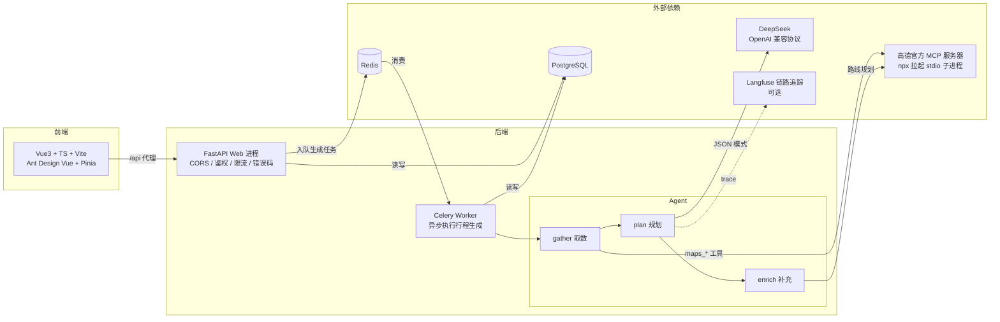

# Trip-AI 第二版技术方案

> 本文档记录 Trip-AI 的架构设计、关键技术选型与踩坑决策，是面试讲解与后续维护的依据。
> 交互式 API 文档见运行后的 `/docs`（Swagger）与 `/redoc`。

## 1. 项目定位

Trip-AI 是一个 AI 旅行规划平台：用户输入目的地、日期、偏好，后端编排 **LLM（DeepSeek）+ 高德地图官方 MCP 服务** 取真实数据，生成结构化、可执行的行程计划，支持账户体系、历史行程管理与链接分享。

## 2. 架构总览

关键点：**行程生成是 30–90s 的 LLM+MCP 长任务**，已从请求/响应周期移出。`POST /api/trips/generate` 只做「落库 + 入队」立即返回 `task_id`（202），前端轮询 `GET /api/trips/generate/{task_id}` 取结果。Web 进程保持轻量（不加载 LangChain/MCP 栈），重活全在 worker。

## 3. 技术选型与设计决策（为什么这么做）

| 决策 | 选择 | 为什么 |
| --- | --- | --- |
| Agent 编排 | LangGraph 三节点 `gather → plan → enrich` | 取数、规划、后处理职责分离；enrich 是**确定性**代码，不交给 LLM |
| 高德接入 | 官方 MCP（`@amap/amap-maps-mcp-server`），**stdio 子进程** | 本地子进程连接稳定；早期「托管 SSE 端点」方案有「长连接被服务端断开（ClosedResourceError）」问题 |
| LLM 结构化输出 | **JSON 模式**（`response_format=json_object`），而非 function calling | DeepSeek 对深层嵌套 schema 的 function calling 会返回不完整结果，JSON 模式更稳定 |
| 长任务处理 | Celery + Redis 异步化，`task_acks_late` | 长任务不阻塞请求；worker 崩溃后未完成任务自动重投 |
| 坐标/路线 | **确定性后处理**（enrich 节点），不由 LLM 生成 | LLM 重写计划时常丢失/编造坐标；按名称回填真实坐标，兜底用地址地理编码 |
| LLM 重试 | tenacity：限流(429)/超时/5xx/连接错误指数退避重试 3 次；4xx 不重试 | 只重试可恢复错误，业务性错误（如鉴权）立即失败 |
| 取数规模 | 硬上限：景点 12、酒店 8、天气 4 天 | 每 POI 要再调一次 `search_detail` 补坐标，上限控制总调用数与耗时 |
| 工具调用封装 | 统一超时（30s）+ 异常收敛，失败返回 None 优雅降级 | MCP 子进程可能卡死，永不因单个工具失败阻断整体流程 |
| 迁移 | Alembic | schema 变更可版本化、可回滚、可 `alembic check` 校验一致 |
| 依赖 | pip-tools 锁版本（`requirements.in` → 精确 `==`） | 构建可复现，CI/Docker 每次装同一套版本 |

## 4. 核心链路

1. 用户提交目的地/日期/偏好 → `POST /api/trips/generate`（per-IP 限流）→ 落库 `generation_tasks` + 入队，返回 `task_id`。
2. Celery worker 消费任务，跑 LangGraph：
   - **gather**：确定性调用高德 MCP 工具（`maps_text_search` + `maps_search_detail` + `maps_weather`），产出景点/天气/酒店真实数据。
   - **plan**：把真实数据拼进 prompt，DeepSeek 以 JSON 模式输出结构化计划（`TripPlan` schema，剔除 `routes` 字段）。
   - **enrich**：① 按名称把真实坐标回填到景点/酒店（匹配不到用地理编码兜底）；② 对每天相邻景点调用方向工具，生成 `distance/duration/步骤` 路线。
3. 任务状态机 `pending → processing → completed / failed`，结果持久化，前端轮询后展示（可保存）。
4. 用户可保存行程（JWT 鉴权）、生成只读分享链接（`secrets.token_urlsafe`）。

## 5. 错误码体系

所有错误统一返回信封 `{code, message, detail, request_id}`，`code` 为分段业务错误码：

| 段 | 范围 | 示例 |
| --- | --- | --- |
| 通用 | 1xxxx | `10001` 参数校验、`10002` 未登录、`10005` 不存在、`10007` 请求过于频繁(429) |
| 用户/认证 | 2xxxx | `20001` 邮箱已注册、`20003` 凭证错误 |
| 行程 | 3xxxx | `30001` 行程不存在、`30002` 生成任务不存在 |
| 分享 | 4xxxx | `40001` 链接不存在、`40002` 已过期 |
| 生成 | 5xxxx | `50001` 行程生成失败 |

业务代码统一抛 `BizError(ErrorCode.XXX)`，由全局处理器转成统一结构；校验错误(422)、未捕获异常(500)、限流(429) 也走同一信封。

## 6. 安全设计

- **鉴权**：JWT（HS256）+ bcrypt；`JWT_SECRET` 启动时强制校验（拒绝占位符/过短/空密钥，要求 ≥32 字符）。
- **越权防护**：行程/分享按 `user_id` 隔离，他人资源返回 404（不泄露存在性）。
- **限流**：slowapi 对 `/trips/generate` 按 IP 限流（默认 5/min），返回统一 429 信封。
- **CORS 收严**：源是白名单，方法/请求头也从 `*` 收成显式白名单。
- **密钥管理**：`.env` 不入库；数据库密码经环境变量注入，不写死在编排文件。
- **容器加固**：后端以非 root 用户运行（uid 10001）。

## 7. 可观测性

- **request_id**：`RequestContextMiddleware` 生成/透传 `X-Request-ID`，写入 contextvar 并回写响应头，日志、错误信封、链路追踪共用同一 id。
- **结构化日志**：loguru 统一格式，自动携带 `request_id`。
- **链路追踪**：Langfuse（可选，默认关闭），一次行程生成产出 `trip_generation` trace，覆盖 gather/plan/enrich 节点与 LLM 调用。
- **探针**：`/health` 存活、`/ready` 就绪（DB `SELECT 1` + Redis ping，任一失败返回 503）；容器 healthcheck 基于 `/ready`。

## 8. 测试策略

- **单元测试**：纯函数（security / schemas / 解析 / 错误码 / 重试谓词）。
- **集成测试**：真实 LangGraph 链，用假 LLM / 假 MCP / 空图片服务驱动（不触网、不耗真实 key）。
- **离线评测集**（`tests/test_eval_set.py`）：参数化多个城市场景，回归断言 **JSON 合法 / 天数正确 / 景点不编造 / 坐标已回填 / 路线已生成** —— 改 prompt 或编排逻辑后跑一遍即可判断有没有改坏。
- **CI**：GitHub Actions 在 push/PR 跑 ruff + mypy + pytest（覆盖率报告）。

## 9. 已知取舍与待办

**刻意不做**（对当前量级属过度设计）：agent 长期记忆、危险工具人工审批/沙箱、微服务拆分、token 预算管理、超长上下文摘要、多环境 dev/staging/prod 拆分。

**可继续硬化**（按需）：pip-audit/trivy 漏洞扫描、Redis 后端限流（多实例）、prompt yaml 化 + 版本号、前端 E2E 测试。
